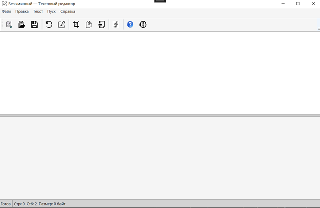
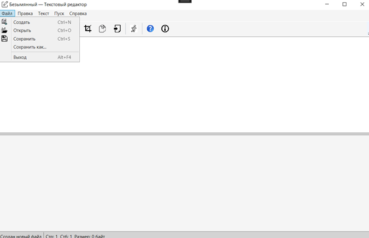
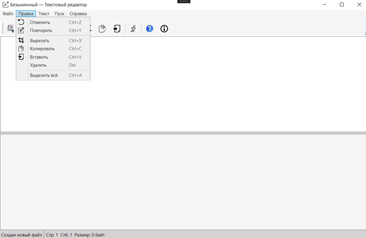
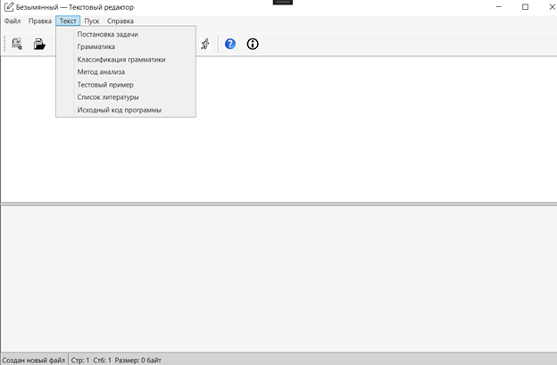
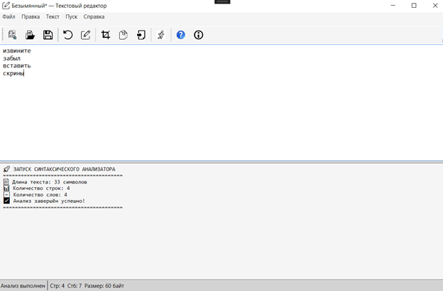
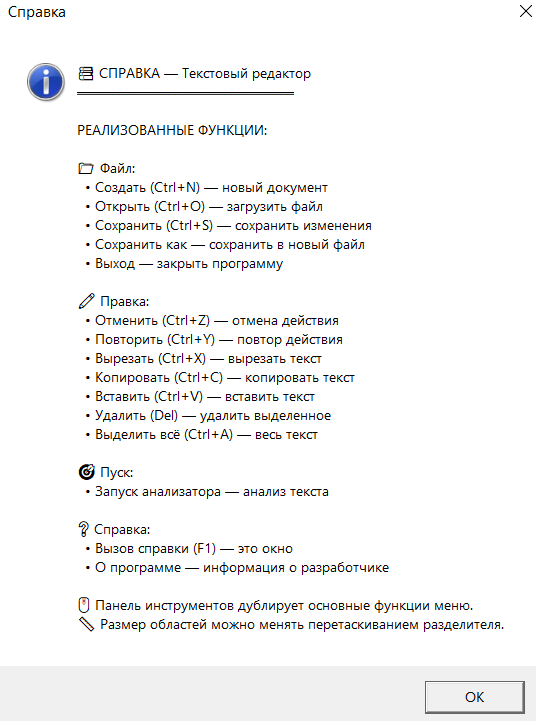
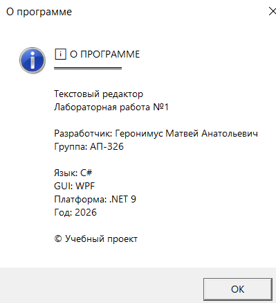

# Лабораторная работа №1 — Разработка GUI для языкового процессора (текстовый редактор)

## Цель работы
Разработать оконное приложение — текстовый редактор, которое в дальнейшем будет расширено до полноценного языкового процессора для анализа исходного кода.

## Автор
- Геронимус Матвей Анатольевич
- Группа: АП-326

## Описание проекта
Приложение представляет собой текстовый редактор с графическим интерфейсом пользователя.

Интерфейс включает четыре основные области:
1) основное меню программы
2) панель инструментов с кнопками быстрого доступа
3) область ввода/редактирования текста
4) область отображения результатов работы (только чтение).

Пользователь может изменять размеры окна приложения и соотношение областей редактирования/вывода с помощью разделителя (GridSplitter). При необходимости автоматически появляются полосы прокрутки.

## Реализованные функции

### Меню «Файл»
- **Создать** (Ctrl+N) — создание нового документа
- **Открыть** (Ctrl+O) — открытие файла
- **Сохранить** (Ctrl+S) — сохранение текущих изменений
- **Сохранить как…** — сохранение в новый файл
- **Выход** (Alt+F4) — выход из приложения с подтверждением сохранения изменений

### Меню «Правка»
- **Отменить** (Ctrl+Z)
- **Повторить** (Ctrl+Y)
- **Вырезать** (Ctrl+X)
- **Копировать** (Ctrl+C)
- **Вставить** (Ctrl+V)
- **Удалить** (Del)
- **Выделить всё** (Ctrl+A)

### Меню «Текст»
На текущем этапе пункты меню реализованы как информационные окна-заглушки (будет расширено в следующих лабораторных работах).

### Команда «Пуск»
Запуск демонстрационного анализа текста и вывод результатов в область результатов (ReadOnly).

### Меню «Справка»
- **Вызов справки** (F1) — описание реализованных функций
- **О программе** — сведения о приложении и авторе

## Используемые технологии
- Язык программирования: **C#**
- GUI-фреймворк: **WPF**
- Платформа: **.NET 9**
- Среда разработки: **Visual Studio** (или совместимая)

## Инструкция по сборке и запуску

### Вариант 1 — запуск из исходников (нужен .NET SDK)
```bash
dotnet restore
dotnet build
dotnet run
```
### Вариант 2 — переносимая сборка (Self-contained)

Сборка версии, которая запускается на целевой машине без установленной IDE и SDK:
```bash
dotnet publish -c Release -r win-x64 --self-contained true
```
Готовый исполняемый файл будет находиться в папке:
```bash
bin/Release/net9.0-windows/win-x64/publish/
```

## Скриншоты работы программы и описание интерфейса

---

### 1. Главное окно программы



Главное окно содержит:
- меню программы;
- панель инструментов;
- область редактирования текста;
- область вывода результатов (только чтение);
- строку состояния.

---

### 2. Меню «Файл»



Позволяет:
- Создать документ (Ctrl+N)
- Открыть файл (Ctrl+O)
- Сохранить (Ctrl+S)
- Сохранить как…
- Выйти из программы (Alt+F4)

---

### 3. Меню «Правка»



Позволяет выполнять стандартные операции:
- Отменить (Ctrl+Z)
- Повторить (Ctrl+Y)
- Вырезать (Ctrl+X)
- Копировать (Ctrl+C)
- Вставить (Ctrl+V)
- Удалить (Del)
- Выделить всё (Ctrl+A)

---

### 4. Меню «Текст»



Содержит пункты:
- Постановка задачи
- Грамматика
- Классификация грамматики
- Метод анализа
- Тестовый пример
- Список литературы
- Исходный код программы

На текущем этапе открывает информационные окна.

---

### 5. Работа анализатора (команда «Пуск»)



Вызывается:
- через меню «Пуск»
- через кнопку на панели инструментов

После запуска выводит:
- длину текста;
- количество строк;
- количество слов;
- сообщение об успешном завершении анализа.

---

### 6. Окно справки



Вызывается:
- Меню → Справка → Вызов справки
- Горячая клавиша F1
- Кнопка на панели инструментов

Содержит описание реализованных функций.

---

### 7. Окно «О программе»



Содержит:
- название проекта;
- сведения о разработчике;
- используемые технологии;
- год выполнения работы.
