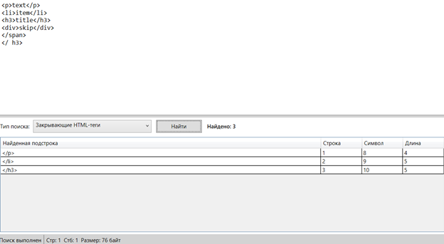
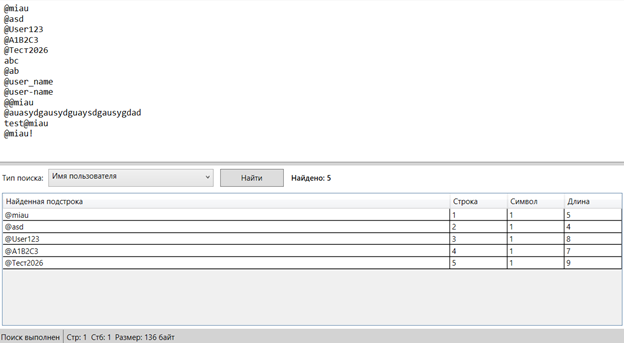
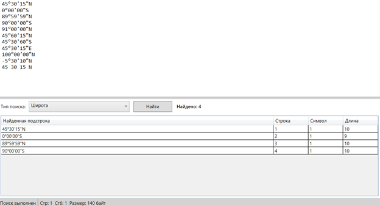
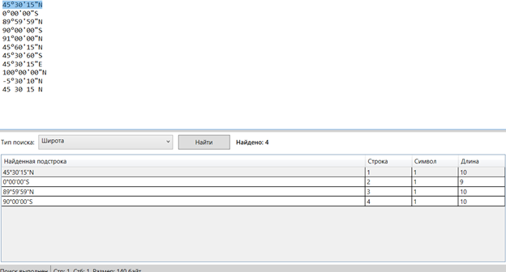

# Лабораторная работа №4  
## Реализация алгоритма поиска подстрок с помощью регулярных выражений

## 🎯 Цель работы
Изучить теоретические основы регулярных выражений и их применение для поиска и извлечения подстрок из текста. Освоить практические навыки использования библиотечных средств работы с регулярными выражениями, а также интеграцию алгоритмов поиска в графический интерфейс приложения.

## 👨‍💻 Автор
**Геронимус Матвей Анатольевич**  
**Группа:** АП-326

---

## 📌 Постановка задачи
Разработать модуль поиска подстрок с использованием регулярных выражений, интегрировать его в существующее приложение (текстовый редактор) и обеспечить наглядный вывод результатов.

Программа должна:
- выполнять поиск подстрок по выбранному регулярному выражению;
- выводить результаты в таблицу;
- отображать найденную подстроку, номер строки, номер символа и длину;
- показывать количество найденных совпадений;
- подсвечивать найденный фрагмент текста при выборе строки в таблице результатов.

### Вариант задания
1. Построить регулярное выражение для поиска закрывающих HTML-тегов `</p>`, `</li>`, `</h3>`.
2. Построить регулярное выражение, описывающее имя пользователя: набор букв и цифр длиной от 4 до 20 символов, первым символом должен быть `@`.
3. Построить регулярное выражение, описывающее широту в формате градусы/минуты/секунды, например `45°30'15"N`, с учётом диапазона корректных значений.

---

# Решение

## Пункт 1

### a) Задание
Построить регулярное выражение для поиска закрывающих HTML-тегов `</p>`, `</li>`, `</h3>`.

### b) Регулярное выражение
```regex
</(?:p|li|h3)>
```

### c) Объяснение
- `<` — символ открытия тега;
- `/` — признак закрывающего тега;
- `(?: ... )` — группа без сохранения;
- `p|li|h3` — один из трёх допустимых тегов;
- `>` — символ окончания тега.

Таким образом, выражение находит только указанные закрывающие HTML-теги.

### d) Примеры строк, которые должны находиться
```text
</p>
</li>
</h3>
```

### e) Примеры строк, которые не должны находиться
```text
<p>
<li>
<h3>
</div>
</span>
```

### f) Тестовые примеры (скриншоты)


---

## Пункт 2

### a) Задание
Построить регулярное выражение, описывающее имя пользователя: набор букв и цифр длиной от 4 до 20 символов, первым символом должен быть `@`.

### b) Регулярное выражение
```regex
(?<!\S)@[A-Za-zА-Яа-яЁё0-9]{3,19}(?!\S)
```

### c) Объяснение
- `(?<!\S)` — перед именем пользователя не должно быть непробельного символа, то есть слева должен быть либо пробел, либо начало строки;
- `@` — обязательный первый символ имени пользователя;
- `[A-Za-zА-Яа-яЁё0-9]` — допустимы латинские буквы, русские буквы и цифры;
- `{3,19}` — после `@` должно быть от 3 до 19 символов;
- `(?!\S)` — после имени пользователя не должно быть непробельного символа, то есть справа должен быть либо пробел, либо конец строки.

Итоговая длина имени пользователя — от 4 до 20 символов вместе с `@`.

### d) Примеры строк, которые должны находиться
```text
@miau
@asd
@User123
@A1B2C3
@Тест2026
```

### e) Примеры строк, которые не должны находиться
```text
abc
@ab
@user_name
@user-name
@@miau
test@miau
@miau!
@auasydgausydguaysdgausygdad
```

### f) Тестовые примеры (скриншоты)


---

## Пункт 3

### a) Задание
Построить регулярное выражение, описывающее широту в формате градусы/минуты/секунды, например `45°30'15"N`, с учётом диапазона корректных значений.

### b) Регулярное выражение
```regex
(?<![-\d])(?:[0-8]?\d|90)°(?:[0-5]?\d)'(?:[0-5]?\d)"[NS](?![A-Za-z])
```

### c) Объяснение
- `(?<![-\d])` — перед широтой не должно быть знака минус или цифры;
- `(?:[0-8]?\d|90)` — градусы от `0` до `90`;
- `°` — знак градусов;
- `(?:[0-5]?\d)` — минуты от `0` до `59`;
- `'` — знак минут;
- `(?:[0-5]?\d)` — секунды от `0` до `59`;
- `"` — знак секунд;
- `[NS]` — направление: `N` (северная широта) или `S` (южная широта);
- `(?![A-Za-z])` — после обозначения направления не должно быть букв.

Выражение корректно находит только допустимые значения широты.

### d) Примеры строк, которые должны находиться
```text
45°30'15"N
0°00'00"S
89°59'59"N
90°00'00"S
```

### e) Примеры строк, которые не должны находиться
```text
91°00'00"N
45°60'15"N
45°30'60"S
45°30'15"E
100°00'00"N
-5°30'10"N
45 30 15 N
```

### f) Тестовые примеры (скриншоты)


---

## Подсветка найденного фрагмента
При выборе строки в таблице результатов соответствующая найденная подстрока выделяется в области редактирования текста.



---

# Результат работы программы
В ходе выполнения лабораторной работы в существующее приложение «Текстовый редактор» был интегрирован модуль поиска подстрок с использованием регулярных выражений.

Реализованы:
- выбор типа поиска из трёх вариантов;
- запуск поиска по выбранному шаблону;
- вывод результатов в таблицу;
- отображение найденной подстроки, строки, позиции и длины;
- подсчёт количества найденных совпадений;
- выделение найденного фрагмента в тексте при выборе строки в таблице.

---

# Вывод
В ходе выполнения лабораторной работы были изучены основы регулярных выражений и способы их применения для поиска подстрок в тексте. Были получены практические навыки составления регулярных выражений, проверки корректности найденных совпадений и интеграции алгоритма поиска в графический интерфейс приложения на WPF.
